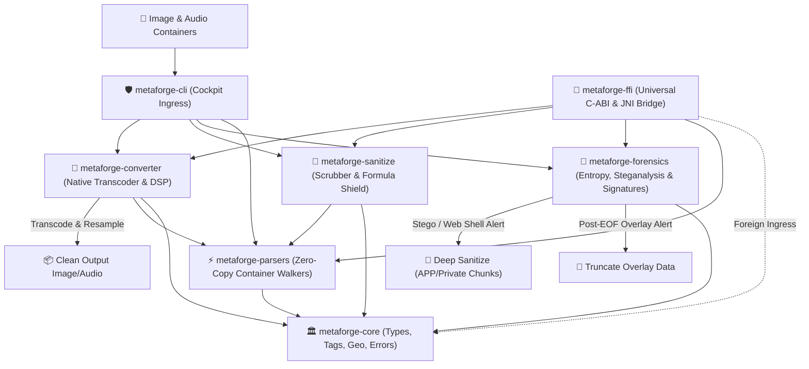

# 🖼️ MetaForge

[](LICENSE)
[](docs/ARCHITECTURE.md)
[](docs/DEVELOPER_GUIDE.md)
[](docs/ARCHITECTURE.md)

An enterprise-grade, zero-dependency sovereign media engine for digital image and audio containers. **MetaForge** audits container structure, extracts deep EXIF/GPS/TIFF metadata, performs statistical steganalysis, scrubs sensitive tracking footprints, extracts linear audio from video, and transcodes media across standard formats—statically compiled with **zero dynamic C/FFI dependencies**.



---

## 🌟 Why MetaForge?

Every digital image and media recording carries hidden layers:
* **Privacy Leaks**: Photos taken on smartphones or cameras silently record your exact physical GPS coordinates, camera serial numbers, device model, and capture timestamp.
* **Security Risks**: Cyber threats often conceal malicious scripts, web shells, or hidden executable archives appended beyond the end of an ordinary photo, or secretly modulate pixel bitstreams (steganography) to exfiltrate data.
* **Format Fragmentation**: Media libraries often require different tools to inspect tags, extract audio, convert formats, or strip tracking metadata before publishing.

**MetaForge unifies these duties into one cohesive native engine.** Operating with zero dynamic external runtimes, it processes media in sub-millisecond speeds directly in memory without risking computer lockups or memory corruption.

---

## 🚀 Key Capabilities

### 🔍 Deep Metadata Extraction & Probing
* **Container Structure**: Sequentially walks raw segments, markers, chunks, and boxes without decoding pixel buffers into RAM.
* **Comprehensive EXIF/TIFF Dictionary**: Translates over 200 standard tags, camera settings, lens specifications, and exposure values.
* **WGS84 GPS Conversion**: Automatically converts Degrees/Minutes/Seconds (DMS) coordinates into standard decimal latitude/longitude with direct map links.
* **Media Telemetry Probing**: Inspects stream properties, dimensions, track counts, sample rates, channels, and bit depths (`metaforge probe`).

### 🧼 Lossless Privacy Sanitization
* **Total Metadata Strip**: Removes private camera markers, EXIF blocks, XMP packets, and manufacturer notes while keeping picture quality 100% identical.
* **Overlay Truncation**: Slices away hidden data appended past the logical end-of-file (post-EOF) without recompressing pixels.
* **Comment Management**: View, add, modify, or delete embedded JPEG comments and PNG textual tags in place or to new files.

### 🔬 Advanced Forensics & Statistical Steganalysis
* **Shannon Entropy ($0.0 - 8.0$ bits/byte)**: Quantifies byte randomness to identify compressed Trojan payloads or encrypted channels.
* **Chi-Square Goodness-of-Fit**: Analyzes byte distribution uniformities across 256 bins ($df = 255$) to detect hidden message embeddings.
* **Pairs-of-Values (PoVs) Attack**: Detects artificial histogram equalization resulting from sequential Least Significant Bit (LSB) steganography.
* **Polyglot Signature Harvester**: Flags hidden files disguised inside images (ZIP archives, PDFs, Windows PE executables, Linux ELF binaries, PHP web shells).

### 🔄 Native Media Transcoding & Audio Extraction
* **Cross-Format Image Transcoding**: Seamlessly converts between JPEG, PNG, WebP, GIF, BMP, and TIFF with adjustable quality and spatial resizing.
* **High-Fidelity Audio Extraction**: Pulls clean linear PCM audio from video containers (MP4, MKV, WebM, MOV) and transcodes audio formats (FLAC, MP3, OGG $\to$ WAV).
* **Linear Audio DSP**: Downmixes multi-channel audio to mono/stereo, resamples frequencies ($16\text{ kHz}, 44.1\text{ kHz}, 48\text{ kHz}$), and applies peak normalization to eliminate clipping.
* **UNIX Stdio Piping**: Full stdin/stdout streaming support for zero-disk-I/O shell pipelines (`cat input.mp4 | metaforge convert - - -t wav > audio.wav`).

### 🗂️ Recursive Concurrent Batch Engine
* **Folder & Album Transcoding**: Batch-converts directory trees with relative folder preservation or flattened export.
* **Pre-Flight Dry Run**: Accurately estimates file counts and disk space impact before modifying any files (`--dry-run`).
* **Hardware Protection Guardrail**: Automatically throttles worker threads to prevent workstation freezes.

### 🌉 Universal Foreign Function Interface (`metaforge-ffi`)
* **Dual C-ABI & JNI Bridge**: Exposes metadata scanning, security audits, sanitization, and transcoding to Java, C/C++, Python, and foreign runtimes with zero UI dependencies.
* **Drop-in Backward Compatibility**: Integrates seamlessly with legacy application bridges and modern cloud microservices.

---

## 📂 Supported Container Formats

| Container Type | Metadata & Marker Parsing | Forensic Steganalysis | Privacy Scrubbing | Media Transcoding |
| :--- | :---: | :---: | :---: | :---: |
| **JPEG** (`.jpg`, `.jpeg`) | APP0–APP15, COM, SOF, SOS, EXIF, XMP | Shannon Entropy, Chi-Square, PoVs, Overlays | Lossless APP Stripping, EOF Truncation | $\leftrightarrow$ PNG, WebP, GIF, BMP, TIFF |
| **PNG** (`.png`) | IHDR, tEXt, iTXt, pHYs, eXIf, iCCP | Shannon Entropy, Chunk Overlays, Polyglots | Ancillary Chunk Stripping, Overlay Truncate | $\leftrightarrow$ JPEG, WebP, GIF, BMP, TIFF |
| **WebP** (`.webp`) | RIFF container, `VP8X`, EXIF, XMP | RIFF size checks, Shannon Entropy | Lossless header scrubbing | $\leftrightarrow$ JPEG, PNG, GIF, BMP, TIFF |
| **GIF** (`.gif`) | Screen Descriptors, Comments, Extensions | Block bounds, Trailing Overlays | Extension Stripping | $\leftrightarrow$ JPEG, PNG, WebP, BMP, TIFF |
| **HEIC** (`.heic`) | ISOBMFF Box Walk (`ftyp`, `meta`, `ispe`, EXIF) | Nested Box Validation, Cyclic Bomb Defense | Metadata Extraction | Demuxing & Inspection |
| **WAV** (`.wav`) | RIFF / WAVE format blocks, channels, sample rate | Audio stream inspection | Audio Probing | Linear DSP Resampling, Channels, Gain |
| **Video** (`.mp4`, `.mkv`, `.webm`) | Track inspection, durations, audio codecs | Audio stream discovery | Telemetry Probing | $\to$ Pristine Linear PCM WAV Audio |
| **Audio** (`.mp3`, `.flac`, `.ogg`, `.aac`)| Stream bitrates, channels, sample rates | Frequency & bit depth inspection | Telemetry Probing | $\to$ Standard Uncompressed WAV Audio |

---

## ⚡ Quick Start

### 1. Inspect a Photo's Hidden Metadata
Discover camera settings, timestamp, and location data in a clean, human-readable table:
```bash
metaforge photo.jpg
```

> [!TIP]
> You can export the inspection results directly to pretty JSON or spreadsheet-ready CSV:
> ```bash
> metaforge photo.jpg -f json > info.json
> metaforge photo.jpg -f csv > report.csv
> ```

### 2. Strip Private Geolocation & Camera Identifiers
Wipe all personal identifiers before sharing an image online, keeping image quality untouched:
```bash
metaforge sanitize photo.jpg -o safe_to_share.jpg
```

### 3. Run a Security & Steganography Audit
Scan for malicious file attachments, hidden payloads, or suspicious byte patterns:
```bash
metaforge audit suspicious_file.png
```

### 4. Extract Audio from a Video
Pull clean audio from a video recording and resample it for voice transcription:
```bash
metaforge convert presentation.mp4 voice.wav --channels 1 --rate 16000 --normalize
```

### 5. Convert & Resize Images for the Web
Convert photos to modern WebP format with custom dimensions and quality:
```bash
metaforge convert banner.png banner.webp --resize 1280x720 --quality 80
```

### 6. Batch Convert an Entire Album
Convert all JPEG photos in a folder into WebP while keeping the folder structure organized:
```bash
metaforge batch ./raw_photos ./optimized_web --ext jpg,jpeg --target webp
```

---

## 🏛️ Sovereign 7-Crate Architecture

MetaForge enforces strict **One-Job-Principle (OJP)** decoupling across 7 independent crates:

```text
metaforge/
├── Cargo.toml                  # Sovereign Workspace Manifest
├── docs/                       # Architectural & Technical Manuals
│   ├── ARCHITECTURE.md         # In-depth topology, algorithms & flowcharts
│   ├── CLI_REFERENCE.md        # Comprehensive command & flag reference
│   ├── DEVELOPER_GUIDE.md      # Build workflows, testing & contribution guide
│   └── USER_GUIDE.md           # Step-by-step operational tutorials & scenarios
├── scripts/                    # Sovereign Operations Suite
│   ├── metaforge-arch.sh       # Topology inspector & OJP invariant auditor
│   ├── metaforge-build.sh      # Native & static musl release builder
│   └── metaforge-test.sh       # 6-Tier TDD & adversarial verification harness
├── crates/
│   ├── metaforge-core/         # Domain models, EXIF/GPS dictionary, geo-math, errors
│   ├── metaforge-parsers/      # Zero-copy binary container scanners (JPEG, PNG, WebP, GIF, HEIC)
│   ├── metaforge-forensics/    # Shannon entropy, Chi-Square steganalysis, PoVs & polyglots
│   ├── metaforge-sanitize/     # Lossless scrubber, comment editor, formula-injection shield
│   ├── metaforge-converter/    # Native media transcoding, audio DSP, probing & batch engine
│   ├── metaforge-ffi/          # Universal C-ABI & dual modern/legacy JNI bridge
│   └── metaforge-cli/          # Cockpit CLI orchestrator, monospace tables, report streaming
└── test_images/                # Calibration and forensic verification assets
```

---

## 🛡️ Built-In Defensive Guardrails (`POC TDD+++++`)

MetaForge includes 22 dedicated adversarial self-attack tests asserting resilience against malicious inputs:
1. **Formula Injection Immunity**: Automatically neutralizes CSV injection payloads (`=`, `+`, `-`, `@`, `\t`, `\r`) by prefixing safe single-quotes (`'`).
2. **Terminal & Log Defense**: Strips raw ANSI CSI control codes and OSC 8 hyperlink sequences from untrusted camera metadata before printing to console.
3. **Decompression Bomb Protection**: Rejects corrupted headers requesting excessive image dimensions ($> 16,384 \times 16,384\text{ px}$) or extreme chunk sizes to eliminate memory exhaustion (DoS).
4. **Zero-Panic Discipline**: Core library crates return typed error results rather than crashing the host process.

---

## 📚 Documentation Map

* 📖 **[User Operation Guide](docs/USER_GUIDE.md)**: Real-world operational scenarios, table interpretations, and privacy guides.
* 🛠️ **[Command-Line Reference](docs/CLI_REFERENCE.md)**: Complete inventory of commands, flags, and pipeline parameters.
* 🧬 **[Architecture & Design Manual](docs/ARCHITECTURE.md)**: Deep dive into binary parsing mechanics, entropy mathematics, and memory safety.
* 💻 **[Developer & Contribution Guide](docs/DEVELOPER_GUIDE.md)**: Build instructions, static musl packaging, and the 6-tier TDD test suite.

---

## ⚖️ License
Distributed under the MIT License.
