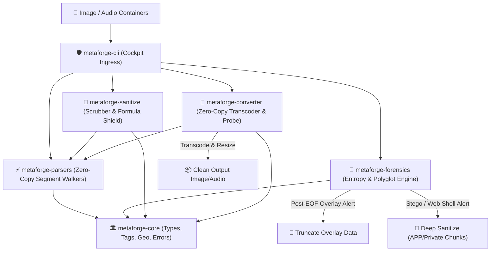

# 🖼️ `metaforge`

An enterprise-grade, zero-dependency, ultra-fast compiled sovereign forensics and media transcoding engine designed to audit, scan, sanitize, and convert binary containers. It extracts structural segment/chunk layouts, parses EXIF/XMP/TIFF metadata, calculates Shannon Entropy, detects hidden/embedded malicious polyglot payloads, losslessly scrubs metadata, and transcodes images (JPEG, PNG, WebP, GIF, BMP, TIFF) and audio (WAV) containers with zero C/FFI dependencies.



---

## 🚀 Key Features

*   **⚡ Zero-Dependency Image & Media Parsing**: Native structural scanners that sequentially parse segments, chunks, blocks, and boxes without loading pixel buffers into memory (sub-millisecond runtime).
*   **📂 Multi-Format Support**: Comprehensive coverage across major containers:
    *   **JPEG**: APP0–APP15, COM, DQT, DHT, SOF0/SOF2, SOS, EXIF/XMP, and marker layouts.
    *   **PNG**: Full chunk walk (IHDR, PLTE, IDAT, IEND, tEXt, iTXt, pHYs, tIME, iCCP, eXIf, sBIT, bKGD, oFFs, sCAL).
    *   **WebP**: RIFF container parsing, Extended Headers (`VP8X`), and `EXIF`/`XMP` metadata.
    *   **GIF**: Logical Screen Descriptor, Comment Extensions (`0xFE`), and XMP Application Extensions (`0xFF`).
    *   **HEIC**: ISOBMFF Box parsing, Spatial Extents (`ispe`), item location extents, and TIFF EXIF decoding.
    *   **WAV Audio**: Linear PCM RIFF containers, stream probing, channel upmixing/downmixing, and sample resampling.
*   **🔄 Zero-Dependency Media & Image Transcoding (`metaforge-converter`)**:
    *   **Cross-Format Image Transcoding**: Convert seamlessly across JPEG, PNG, WebP, GIF, BMP, and TIFF.
    *   **Quality & Resize Controls**: Adjustable compression quality (`--quality 1-100`) and arbitrary dimension scaling (`--resize WxH`).
    *   **WAV Audio Transcoding**: Pure Rust sample-rate resampling and channel mixing (stereo-to-mono downmixing, mono-to-stereo upmixing).
    *   **Stream Telemetry Probing**: Inspect container kind, dimensions, sample rates, channels, and bit depths (`metaforge probe`).
*   **🔍 Forensic Signature Scanner**: Walk-scans files beyond the logical end-of-file (EOF) offset to flag overlays, trailing payloads, or embedded assets (e.g., hidden ZIP archives, PDF docs, PE/ELF executables, PHP shells, or scripting blocks).
*   **🛡️ Tier 6 Adversarial Self-Attack Immunity (`POC TDD+++++`)**:
    *   **Formula & Code Injection Defense**: Automatically neutralizes spreadsheet injection attack vectors (`=`, `+`, `-`, `@`, `\t`, `\r`) in CSV exports by prefixing single-quotes (`'`).
    *   **Terminal & Log Poisoning Defense**: Scrubs raw ANSI CSI control codes and OSC 8 hyperlink sequences from untrusted metadata tags before printing to console.
    *   **Resource Exhaustion & Allocation Bomb Resistance**: Rigorous boundary checks disallowing billion-byte chunk length allocations, cyclical nested ISOBMFF boxes, corrupt RIFF sizes, or dimension decompression bombs ($> 16,384 \times 16,384$).
*   **🧼 Advanced Sanitizers & Lossless Scrubbers**:
    *   **Overlay Truncation**: Slices away appended overlay payloads from the logical end-of-file without altering compressed pixel bitstreams.
    *   **Deep Sanitization**: Strips out comments and metadata fields (APP1–APP15 in JPEG; ancillary/private chunks in PNG) to neutralize web shell injection threats.
    *   **Comment & Text Tag Editor**: Losslessly edits JPEG COM segments and PNG textual chunks (`tEXt`/`iTXt`) in-place or into clean target copies.
*   **📊 Shannon Entropy Calculation**: Computes byte distribution randomness ($0.0$ to $8.0$ bits/byte) to identify encrypted payloads or high-entropy steganography.
*   **📦 Standalone Musl Compilation**: 100% statically linked standalone binary targeting `x86_64-unknown-linux-musl` with zero glibc or dynamic runtime dependencies.

---

## 📖 Sovereign Documentation Map

*   **🧬 [System Architecture & Design Manual](docs/ARCHITECTURE.md)**: Detailed breakdown of the 6 decoupled OJP crates, memory layouts, and data flows.
*   **🛠️ [Command-Line Interface Reference](docs/CLI_REFERENCE.md)**: Subcommands, options, export formats, and execution matrix.
*   **💻 [Developer & Contribution Guide](docs/DEVELOPER_GUIDE.md)**: Build workflows, 6-tier TDD test harness, and crate boundaries.
*   **📖 [End-User Operation Guide](docs/USER_GUIDE.md)**: Real-world operational scenarios, table layouts, and forensic audit evaluations.

---

## 💻 CLI Usage & Commands

### 1. Build and Compile
```bash
# Build native optimized binary
./scripts/metaforge-build.sh native

# Build standalone static musl release binary
./scripts/metaforge-build.sh musl --strip

# Package release tarball with SHA-256 checksum
./scripts/metaforge-build.sh musl --strip --package
```

### 2. Inspect Architecture & Crate Boundaries
```bash
./scripts/metaforge-arch.sh summary
./scripts/metaforge-arch.sh audit
```

### 3. Run Test Suites & Adversarial Harvester
```bash
# Run complete test harness across all 6 crates
./scripts/metaforge-test.sh --all

# Run Tier 6 Red-Team Adversarial Self-Attack suites only
./scripts/metaforge-test.sh --adversarial
```

### 4. Basic Metadata Extraction
```bash
metaforge test_images/img6-gps.jpg
```

### 5. Media & Stream Telemetry Probe
```bash
metaforge probe test_images/img6-gps.jpg
metaforge probe sample_audio.wav
```

### 6. Zero-Dependency Media & Image Conversion
```bash
# Convert JPEG to PNG
metaforge convert test_images/img6-gps.jpg output.png

# Convert and resize image to WebP with custom quality
metaforge convert test_images/flower.png thumbnail.webp --resize 320x240 --quality 80

# Transcode WAV audio: downmix to Mono and resample to 22,050 Hz
metaforge convert stereo_input.wav mono_output.wav --channels 1 --rate 22050
```

### 7. Steganography & Forensics Audit
```bash
metaforge audit test_images/img6-gps.jpg
```

### 8. Low-Level Segment / Chunk Dump
```bash
metaforge dump test_images/img6-gps.jpg
```

### 9. Lossless Metadata Sanitization
```bash
# Strip all private metadata and truncate trailing overlays
metaforge sanitize test_images/img6-gps.jpg -o clean_image.jpg

# Only truncate trailing overlay data, preserving valid metadata
metaforge sanitize test_images/img6-gps.jpg --overlay-only -o no_overlay.jpg
```

### 10. Comment & Text Tag Editing
```bash
# Set JPEG comment
metaforge comment test_images/img1.jpg -s "Authorized Forensic Archive" -o archive.jpg

# Read current comment
metaforge comment archive.jpg
```

---

## 🧬 Sovereign 6-Crate Workspace Topology

The repository follows strict **One-Job-Principle (OJP)** architectural decoupling:

```text
metaforge/
├── Cargo.toml                  # Workspace Root Manifest
├── docs/                       # Architectural & Technical Manuals
│   ├── ARCHITECTURE.md
│   ├── CLI_REFERENCE.md
│   ├── DEVELOPER_GUIDE.md
│   └── USER_GUIDE.md
├── scripts/                    # Sovereign Operations Suite
│   ├── metaforge-arch.sh       # Topology inspector & OJP auditor
│   ├── metaforge-build.sh      # Static musl packager with SHA-256
│   ├── metaforge-test.sh       # 6-Tier TDD & adversarial runner
│   └── lib/                    # ANSI colors, UI singletons, regex engine
├── crates/
│   ├── metaforge-core/         # Domain models, EXIF/GPS dictionary, geo-math, errors
│   ├── metaforge-parsers/      # Zero-copy binary container scanners (JPEG, PNG, WebP, GIF, HEIC)
│   ├── metaforge-forensics/    # Shannon entropy (0.0-8.0), overlay detector, polyglot signatures
│   ├── metaforge-sanitize/     # Lossless scrubber, comment editor, formula-injection shield
│   ├── metaforge-converter/    # Zero-dependency image/audio transcoding, stream probing, resizer
│   └── metaforge-cli/          # Cockpit CLI orchestrator, monospace tables, CSV/JSON/JSONL export
└── test_images/                # Calibration test assets
```

---

## ⚖️ License
Distributed under the MIT License.
