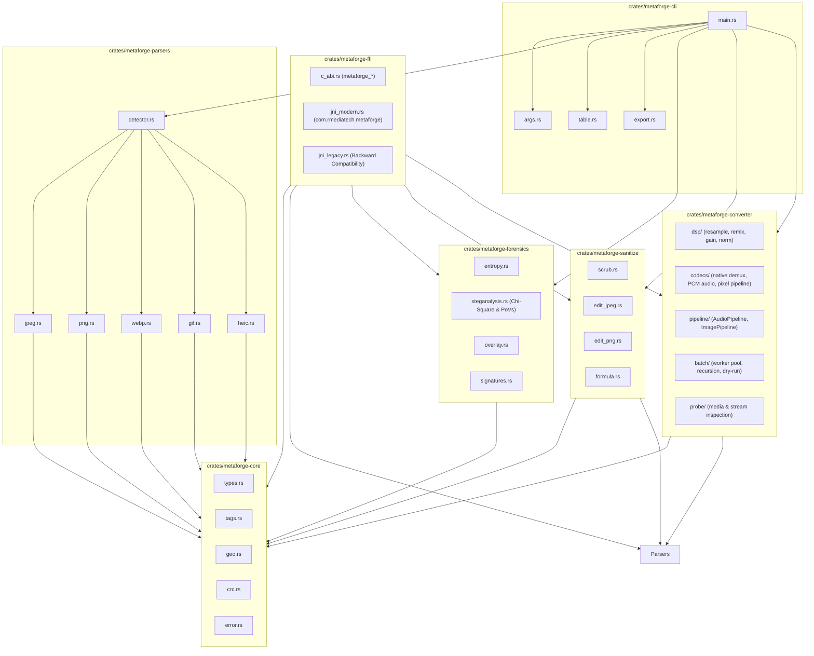

# 🧬 MetaForge Architecture & Design Manual

This document details the modular layout, container flowcharts, data structures, and defensive invariants of the **MetaForge** sovereign architecture.

---

## 🏛️ 1. Sovereign 7-Crate Workspace Topology

MetaForge enforces strict **One-Job-Principle (OJP)** decoupling across seven independent crates. Each crate maintains strict boundaries with zero circular dependencies or UI bloat:

| Crate Name | Directory | Sovereign Duty (OJP) | Core Invariants |
| :--- | :--- | :--- | :--- |
| **`metaforge-core`** | `crates/metaforge-core` | Domain types, 200+ EXIF/TIFF/GPS dictionary, WGS84 geo-math, CRC32, typed errors | Zero parser or disk I/O logic. |
| **`metaforge-parsers`** | `crates/metaforge-parsers` | Zero-copy binary container scanners (JPEG, PNG, WebP, GIF, HEIC) | Zero terminal formatting; returns structured data. |
| **`metaforge-forensics`**| `crates/metaforge-forensics`| Shannon entropy ($0.0-8.0$), Chi-Square steganalysis, PoVs detector, post-EOF overlays, polyglots | Pure statistical analysis; zero pixel rendering. |
| **`metaforge-sanitize`** | `crates/metaforge-sanitize` | Lossless metadata scrubbing, post-EOF truncation, comment editor, formula-injection shield | Zero image re-encoding; operates directly on bitstream. |
| **`metaforge-converter`**| `crates/metaforge-converter`| Native multi-format image & audio/video transcoding, DSP resampler, batch worker pool | Pure native code; zero C/FFI runtime bindings. |
| **`metaforge-ffi`** | `crates/metaforge-ffi` | Universal C-ABI & dual modern/legacy JNI Foreign Function Interface bridge | Exposes engine to Java, C, Python, Go with zero UI. |
| **`metaforge-cli`** | `crates/metaforge-cli` | Unified terminal cockpit, monospace tables, structured exporter (JSON/CSV), streaming pipes | Zero low-level container parsing; strictly ingress/egress. |

---

## 📸 2. Container Parsing & Zero-Copy Segment Traversal

Each container parser operates directly over immutable byte slices (`&[u8]`) without allocating bulky intermediate buffers:

### JPEG Marker Traversal

### PNG Chunk Walk
1. Validates 8-byte PNG signature: `\x89PNG\r\n\x1a\n`.
2. Loops sequentially through chunks: 4-byte length + 4-byte type + payload + 4-byte CRC-32.
3. Decodes standard chunks:
   * `IHDR`: Width, height, bit depth, color type, compression method.
   * `pHYs`: Pixel dimensions and physical resolution calculation.
   * `tEXt` / `iTXt`: Textual metadata and comments.
   * `eXIf`: Raw EXIF block embedded in PNG.
4. Ceases traversal upon encountering the `IEND` marker, recording any trailing bytes as post-EOF overlay.

---

## 🔄 3. Native Media Transcoding & Batch Processing Engine (`metaforge-converter`)

The `metaforge-converter` crate enforces strict internal subsystem separation:

### 1. Pure Digital Signal Processing (`dsp/`)
* **Resampling**: Deterministic linear interpolation across arbitrary sample frequencies (e.g. $48,000\text{ Hz} \leftrightarrow 44,100\text{ Hz} \leftrightarrow 16,000\text{ Hz}$).
* **Channel Matrixing**: Downmixing (multi-channel to stereo/mono with $M_i = \frac{\sum C_{i}}{N}$ normalization to prevent clipping) and upmixing (mono to stereo).
* **Gain & Normalization**: Linear gain scaling and peak normalization with soft clamping to $[-1.0, 1.0]$. Zero I/O dependencies.

### 2. Universal Codecs & Demuxers (`codecs/`)
* **Multi-Format Container Demuxing**: Pure native decoding of audio from video containers (MP4, MKV, WebM, MOV) and audio containers (MP3, FLAC, OGG/Vorbis, AAC, WAV, AIFF, CAF). Zero dynamic C/FFI dependencies.
* **Audio Encoding**: High-precision 16-bit signed integer or 32-bit float linear PCM WAV output.
* **Image Processing Pipeline**: Cross-format conversion (JPEG, PNG, WebP, GIF, BMP, TIFF) with high-fidelity spatial resampling and strict allocation bomb defenses ($\le 16,384 \times 16,384\text{ px}$, $\le 256\text{ MP}$).

### 3. Fluent Chainable Pipelines (`pipeline/`)
* `AudioPipeline`: Fluent builder: `.sample_rate(hz).channels(ch).gain(g).normalize(bool).process_file(...)`.
* `ImagePipeline`: Fluent builder: `.target(fmt).quality(q).resize(w, h).process_file(...)`.
* Full UNIX pipe and stdio streaming (`metaforge convert - - -t webp`).

### 4. Concurrent Batch Engine (`batch/`)
* **Recursive Tree Mirroring**: Traverses directory hierarchies, preserving relative paths or optionally flattening into a single target directory.
* **Hardware Protection Guardrail**: Worker pool strictly capped to prevent system resource starvation.
* **Pre-Flight Dry Run (`--dry-run`)**: Scans candidate files, calculates input sizes, and plans output operations without touching the filesystem.

### 5. Media Stream Telemetry Inspector (`probe/`)
* Introspects container headers and tracks, reporting dimensions, audio/video track counts, codecs, duration, channels, and sample rates.

---

## 🔬 4. Steganography & Forensics Engine (`metaforge-forensics`)

### Shannon Entropy Computation
Entropy measures the average information density and randomness in byte distributions ($0.0$ to $8.0$ bits per byte):
$$H(X) = -\sum_{i=0}^{255} P(x_i) \log_2 P(x_i)$$
* **$0.0 - 1.0$**: Homogeneous, zeroed, or uncompressed sparse data.
* **$6.0 - 7.5$**: Standard textual, structural, or low-density bitmap streams.
* **$7.5 - 7.95$**: Normal compressed photographic bitstreams.
* **$> 7.95$**: Encrypted payload, high-entropy steganography, or compressed archive injection.

### Chi-Square Goodness-of-Fit Test
The Chi-Square test determines whether observed byte frequencies deviate significantly from the expected distribution in an entropy-coded stream:
$$\chi^2 = \sum_{i=0}^{255} \frac{(O_i - E_i)^2}{E_i}, \quad df = 255$$
Deviations exceeding the critical threshold ($\chi^2 > 310.457$ at $\alpha = 0.01$) flag artificial anomalies introduced by data hiding tools. $p$-values are approximated using the Wilson-Hilferty transformation.

### Pairs-of-Values (PoVs) LSB Attack
Analyzes adjacent byte pairs $(2k, 2k+1)$ across the entropy continuum. Sequential Least Significant Bit (LSB) embedding causes the frequencies of even and odd values in each pair to equalize prematurely, creating a distinct statistical signature detected by the PoVs analyzer.

### Post-EOF Overlay Detection
Images store data inside well-defined container bounds. MetaForge identifies the exact logical boundary (`0xFFD9` for JPEG, `IEND` chunk for PNG) and compares it with the physical file size on disk to flag any hidden data appended past the end of the file.

### Polyglot Signature Harvester
Scans through binary data past header offsets to discover hidden file signatures without false positives:
* **ZIP / JAR / APK**: `PK\x03\x04`
* **PDF Documents**: `%PDF-`
* **PE Executables**: `MZ` header verified via DOS stub `e_lfanew` pointer to `PE\0\0`.
* **ELF Executables**: `\x7fELF`
* **PHP Web Shells**: `<?php`, `<?=`, `<script language="php">`

---

## 🌉 5. Universal Foreign Function Interface (`metaforge-ffi`)

The `metaforge-ffi` crate compiles as both a dynamic library (`cdylib`) and Rust library (`rlib`), enabling foreign environments to invoke native MetaForge operations:

1. **Modern Sovereign JNI API** (`com.rmediatech.metaforge.MetaForge`):
   * `getVersion()`: Returns native engine version string.
   * `scanJson(path)`: Returns complete metadata JSON string.
   * `auditJson(path)`: Returns forensic audit JSON (entropy, overlay, polyglots, steganalysis).
   * `sanitizeFile(input, output)`: Strips metadata and truncates trailing overlays.
   * `convertFile(input, output, format)`: Transcodes images and audio containers.
2. **Legacy JNI Compatibility Bridges**:
   * Backward-compatible JNI entry points for seamless drop-in upgrades across existing application ecosystems.
3. **Pure C-ABI Exported API**:
   * `metaforge_version()`
   * `metaforge_scan_json(path)`
   * `metaforge_audit_json(path)`
   * `metaforge_sanitize_file(input, output)`
   * `metaforge_convert_file(input, output, format)`
   * `metaforge_free_string(ptr)`

---

## 🛡️ 6. Defensive Invariants (`POC TDD+++++`)

1. **Formula Injection Neutralization**:
   Any cell beginning with `=, +, -, @, \t, \r` in CSV exports is automatically escaped with a leading single-quote `'` to prevent command execution in spreadsheet applications.
2. **Terminal Control Scrubbing**:
   All user-supplied EXIF text, comments, and camera model strings are scrubbed of raw ANSI CSI (`\x1b[...]`) and OSC (`\x1b]...;...`) control sequences before table rendering.
3. **Allocation Bomb Resistance**:
   Segment lengths, box bounds, and image resize dimensions exceeding safety capacity are rejected immediately to prevent memory exhaustion DoS attacks.
4. **Zero-Panic Discipline**:
   Library crates avoid `.unwrap()` and `.expect()` in production code paths, returning structured error types.
