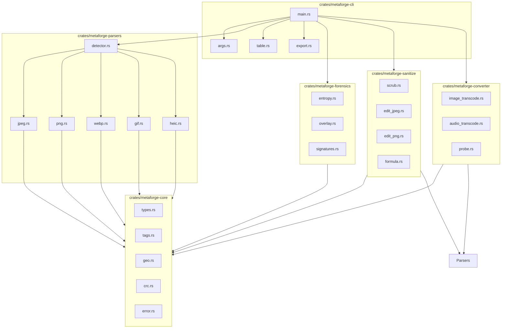
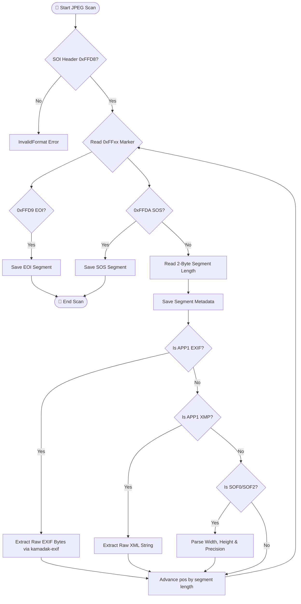

# 🧬 MetaForge Architecture & Design Manual

This document details the modular layout, parsing flowcharts, data structures, and security invariants of `metaforge`.

---

## 🎨 1. Modular Core (Decoupled 6-Crate Workspace)

The codebase strictly enforces the **One-Job-Principle (OJP)** across six independent crates:

1.  **`metaforge-core`**: Foundational domain types (`MetadataEntry`, `ContainerType`), comprehensive 200+ EXIF/TIFF/GPS tag registry, WGS84 GPS coordinate calculations, and strongly typed `MetaForgeError` definitions. Zero parsing logic.
2.  **`metaforge-parsers`**: Zero-copy binary container scanners for JPEG (SOF/SOS/APP markers), PNG (chunk walkers), WebP (RIFF/VP8X), GIF (descriptor blocks), and HEIC (ISOBMFF box hierarchies). Zero terminal or formatting logic.
3.  **`metaforge-forensics`**: Forensics analysis engine calculating Shannon entropy ($0.0$ to $8.0$ bits/byte), post-EOF overlay boundary detection, and signature matching for embedded polyglots (ZIP, PDF, PE, ELF, PHP shells). Zero pixel rendering.
4.  **`metaforge-sanitize`**: Lossless metadata scrubbing, post-EOF truncation, comment injection/removal, and CSV formula injection neutralization (`=`, `+`, `-`, `@`, `\t`, `\r`). Zero bitmap re-encoding.
5.  **`metaforge-converter`**: Pure-Rust, zero-dependency transcoding engine for image containers (JPEG, PNG, WebP, GIF, BMP, TIFF) and audio containers (WAV), channel mixing, sample rate resampling, and stream telemetry probing. Zero C/FFI runtime bindings.
6.  **`metaforge-cli`**: Unified terminal cockpit, monospace table visualizer, structured exporter (Table, JSON, JSONL, formula-shielded CSV), and command orchestrator. Zero raw parsing.

---

## 📸 2. Container Parsing & Segment Walking

Each container parser operates directly over immutable byte slices (`&[u8]`) without allocating image buffers:

### JPEG Marker Traversal

### PNG Chunk Walk
1. Validates 8-byte PNG signature: `\x89PNG\r\n\x1a\n`.
2. Loops sequentially through chunks: 4-byte length + 4-byte type + payload + 4-byte CRC-32.
3. Decodes standard chunks:
   - `IHDR`: Width, height, bit depth, color type, compression method.
   - `pHYs`: Pixel dimensions and DPI calculation.
   - `tEXt` / `iTXt`: Textual metadata and comments.
   - `eXIf`: Raw EXIF block embedded in PNG.
4. Ceases traversal upon encountering the `IEND` marker, recording any trailing bytes as post-EOF overlay.

---

## 🔄 3. Media Transcoding Engine (`metaforge-converter`)

### Image Transcoding Architecture
- Decodes image formats via pure Rust decoders into memory representations.
- Protects against decompression bombs: rejects any input or target dimension $> 16,384 \times 16,384$ pixels or total allocations exceeding 256 megapixels.
- Encodes output using native Rust encoders for JPEG (with quality parameter), PNG, WebP (lossless), BMP, TIFF, and GIF.

### Audio Transcoding Architecture
- Decodes linear PCM WAV streams using pure Rust `hound`.
- Channel Transformation:
  - **Stereo ➔ Mono**: Computes arithmetic mean across channels: $M_i = \frac{L_i + R_i}{2}$.
  - **Mono ➔ Stereo**: Duplicates sample to both output channels.
- Resampling: Deterministic linear interpolation across sample frequencies (e.g. $44,100\text{ Hz} \leftrightarrow 48,000\text{ Hz}$ or downsampling to $22,050\text{ Hz}$).

---

## 🔬 4. Steganography & Forensics Engine

### Shannon Entropy Computation
Entropy quantifies the uncertainty and randomness in the byte distribution ($0.0$ to $8.0$ bits per byte):
$$H(X) = -\sum_{i=0}^{255} P(x_i) \log_2 P(x_i)$$
- **$0.0 - 1.0$**: Homogeneous, zeroed, or uncompressed sparse data.
- **$6.0 - 7.5$**: Standard textual, structural, or low-density bitmap streams.
- **$7.5 - 7.95$**: Normal compressed JPEG/PNG bitstreams.
- **$> 7.95$**: Encrypted payload, high-entropy steganography, or compressed archive injection.

### Post-EOF Overlay Detection
Images often store malicious scripts or payload archives appended directly behind their logical end marker (`0xFFD9` for JPEG, `IEND` chunk for PNG). MetaForge locates the exact logical container boundary, compares it with physical file size, and flags any trailing bytes as post-EOF overlay candidates.

### Polyglot Signature Harvester
Walks data starting past header offsets to discover hidden file signatures without false positives:
- **ZIP / JAR / APK**: `PK\x03\x04`
- **PDF Documents**: `%PDF-`
- **PE Executables**: `MZ` header verified via DOS stub `e_lfanew` pointer to `PE\0\0`.
- **ELF Executables**: `\x7fELF`
- **PHP Web Shells**: `<?php`, `<?=`, `<script language="php">`

---

## 🛡️ 5. Tier 6 Adversarial Invariants (`POC TDD+++++`)

1. **Formula Injection Neutralization**:
   Any cell beginning with `=, +, -, @, \t, \r` in CSV exports is automatically escaped with a leading single-quote `'` to prevent remote code execution in spreadsheet software.
2. **Terminal Escapes Neutralization**:
   All user-supplied EXIF text, comments, and camera model strings are scrubbed of raw ANSI CSI (`\x1b[...]`) and OSC (`\x1b]...;...`) control codes before table rendering.
3. **Allocation Bomb Resistance**:
   Segment lengths, box bounds, and image resize dimensions exceeding safety capacity are rejected immediately to prevent memory exhaustion DoS attacks.
